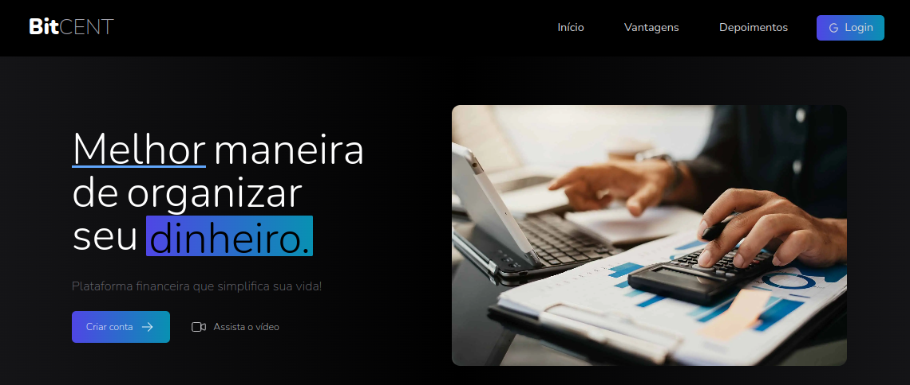

<p align="center">

</p>

<p align="center">
 <a href="#sobre-o-projeto">Sobre</a> •
 <a href="#tecnologias">Tecnologias</a> •
 <a href="#executando-o-projeto">Execução</a> •
  <a href="#license">License</a>
</p>

<h1 align="center">Bitcent</h1>

### Sobre o Projeto

Bitcent é uma aplicação web para controle de finanças pessoais com landing page e dashboard. O projeto utiliza o Firebase para autenticação e armazenamento de dados.


<h2 align="center">
    
</h2>


### Tecnologias

Lista de tecnologias utilizadas no projeto:

- [React](https://reactjs.org)
- [Next.js](https://nextjs.org/)
- [Firebase](https://firebase.google.com/)
- [TypeScript](https://www.typescriptlang.org/)
- [TailwindCSS](https://tailwindcss.com/)
- [Mantine](https://mantine.dev/)

<h1></h1>

### Executando o projeto

1. Clone o repositório:

```bash
$ git clone https://github.com/cardosovanessa/financial-control.git
$ cd bitcent
```

2. Crie um projeto no Firebase e ative o Firestore e Autenticação com Google.

- Permissões do Firestore:

```
rules_version = '2';
service cloud.firestore {
  match /databases/{database}/documents {
    match /{document=**} {
    	allow read, write: if false;
    }

    match /financas/{email}/transacoes/{id} {
  		allow read: if (request.auth != null && request.auth.token.email == email);
      allow write: if (request.auth != null && request.auth.token.email == email);
    }

    match /usuarios/{email} {
  		allow read: if (request.auth != null && request.auth.token.email == email);
      allow write: if (request.auth != null && request.auth.token.email == email);
    }
  }
}
```

3. É preciso criar um arquivo `.env.local` na raiz do projeto com as seguintes variáveis:

```bash
NEXT_PUBLIC_FIREBASE_PROJECT_ID=
NEXT_PUBLIC_FIREBASE_AUTH_DOMAIN=
NEXT_PUBLIC_FIREBASE_API_KEY=
```
Usar as credenciais do seu projeto no Firebase.

4. Dentro da pasta do projeto, execute os comandos abaixo:

```bash
# Instalar as dependências
$ npm install

# Iniciar o projeto
$ npm run dev
```
O app estará disponível no endereço http://localhost:3000.

<h1></h1>

### License

Esse projeto está sob a [licença MIT](LICENSE.md).

<p align="left">
  
  
</p>
